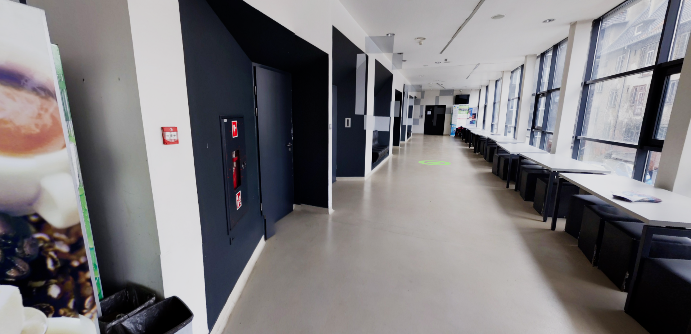

# Table of contents

- [General info](#general-info)
- [Site](#site)
- [Setup](#setup)
- [Technologies](#technologies)
- [License](#License)

# General info

&emsp;&emsp;Web application that allows for a virtual walk around one of the <b>Silesian University of Technology</b> faculty. Application works smiliary to very well know google street view but this time its made for <b>Automatic, Informatics and Robotics</b> faculty.
</br>
</br>

# Site

## Landing page


</br>
</br>

## Sample view


</br>
&emsp;In order to move to next view user has to click on green circle. Doing so will change view with a help of smooth google street view like transition.
</br>

# Setup

There are 2 ways to start this project:

## Basic setup

To run project, install it locally and run using npm:

```
$ npm install
$ npm start
```

## Docker

This project also supports docker. In order to run application using docker-compose type:

```
$ docker-compose up
```

This command will run application in docker container and will be available on address <b>localhost:3001</b>

</br>

<!-- ## Docker

</br>
</br> -->

# Technologies

Project has been created with:

- React.js
- React-spring
- Three.js
- React-three-fiber
  </br>
  </br>

# License

> You can check out the full license [here](https://github.com/IgorAntun/node-chat/blob/master/LICENSE)

This project is licensed under the terms of the **MIT** license.
